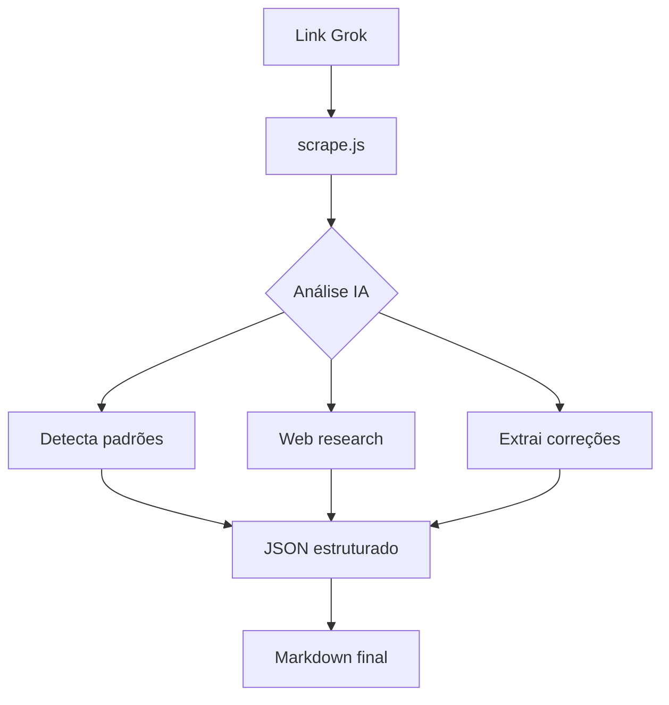

# 🔧 Metodologia Scrappy v2.0 - Captação Contextual Inteligente

## 🎯 Visão Geral

**Objetivo:** Captar conversas Grok (grok.com/share) preservando **100% do contexto humano** - sentimentos, inclinações, correções, perspectivas, erros do modelo, validações conversacionais ("entendeu?", "repete").

**Poder Agentico:** IA analisa profundamente cada fala, detecta inconsistências (Grok não responde mas usuário continua), valida atualidade via web (2025 vs data do modelo), e gera outputs estruturados (JSON + Markdown consolidado).

**Casos de Uso:**
- 1 conversa → 1 transcrição MD
- 5 conversas → pasta `transcricoes/` com 5 JSONs + 1 MD consolidado
- Atualização de docs existentes → detecta contexto prévio e aplica delta

---

## 🧠 Análise Contextual Profunda

### Camadas de Processamento

**1. Captação Bruta (Playwright)**
- Extrai `innerText('body')` completo
- Preserva quebras de linha, espaçamento, estrutura original
- Timeout adaptativo (5-10s) baseado em tamanho da conversa

**2. Detecção de Padrões Conversacionais**
```
"entendeu?" → Marca ponto de confirmação (usuário valida compreensão IA)
"repete"    → Marca solicitação de reiteração (possível erro Grok)
"tá, vamos lá" → Marca transição de contexto (novo tópico)
[silêncio Grok + usuário continua] → Marca erro de resposta (Grok não retornou)
```

**3. Extração de Sentimentos/Inclinações**
- Tom emocional: frustração ("não tá certo"), satisfação ("perfeito"), dúvida ("acho que...")
- Prioridades implícitas: palavras-chave como "urgente", "pendente", "crítico"
- Perspectivas: "na minha opinião", "acredito que", "seria interessante"

**4. Validação de Atualidade (Web Research)**
```javascript
// IA detecta afirmações temporais suspeitas
if (mencao_data_modelo_desatualizada || info_2024_em_contexto_2025) {
  await webSearch(`${topico} atualização 2025`);
  compara_e_corrige(info_modelo, info_web);
}
```
**Exemplo:**
- Grok diz: "Ubuntu 20.04 é a versão mais recente" (desatualizado)
- IA pesquisa: "Ubuntu latest LTS 2025" → Descobre 24.04 LTS
- Correção automática na transcrição: "Ubuntu 24.04 LTS (atualizado via web)"

**5. Detecção de Correções do Usuário**
- "Não, não é assim" → Marca negação de info prévia
- "Na verdade, são 16 Positivo, não Ryzen 7" → Marca correção factual
- "Esquece isso" → Marca anulação de instrução anterior

---

## 📂 Estrutura Multi-Arquivo (Organização Inteligente)

### Cenário 1: Conversa Única
```
scrape.js (executa)
  ↓
TRANSCRICAO-<data>.md (output final)
```

### Cenário 2: Múltiplas Conversas (5 links)
```
scrape-batch.js (executa 5 captações)
  ↓
transcricoes/
├── 001-<uuid>.json      # JSON completo conversa 1
├── 002-<uuid>.json      # JSON completo conversa 2
├── 003-<uuid>.json      # ...
├── 004-<uuid>.json
├── 005-<uuid>.json
└── CONSOLIDADO-<data>.md  # Markdown unificado refatorado
```

**Estrutura JSON Individual:**
```json
{
  "metadata": {
    "uuid": "5dac29e4-dcea-4578-bb58-70b3e699bdc9",
    "capturedAt": "2025-10-30T23:47:00Z",
    "linkOriginal": "https://grok.com/share/...",
    "duracao": "8.2s",
    "tamanho": "49847 bytes"
  },
  "contexto": {
    "documentoBase": "CATALOGACAO-UFRB-CETENS.md",
    "objetivo": "Edição linha a linha - correções catalogação",
    "participantes": ["Deivison Santana", "Grok"]
  },
  "conversaRaw": "Texto bruto completo captado...",
  "analiseContextual": {
    "pontosConfirmacao": [
      { "linha": 45, "texto": "entendeu?", "resposta": "Entendi sim..." }
    ],
    "correcoes": [
      { "linha": 67, "original": "Ryzen 7", "corrigido": "Positivo", "contexto": "Lab 09" }
    ],
    "sentimentos": [
      { "tipo": "frustração", "trigger": "tá um lixão", "contexto": "Lab LAMAV" }
    ],
    "errosGrok": [
      { "linha": 89, "descricao": "Não respondeu, usuário continuou" }
    ]
  },
  "pendenciasExtraidas": [
    { "critica": "Sala 205 sem projetor", "contexto": "tem aulas" },
    { "media": "Refil Epson indisponível", "contexto": "Lab Agroecologia" }
  ],
  "instrucoesEdicao": [
    { "arquivo": "CATALOGACAO-UFRB-CETENS.md", "linha": 6, "acao": "remover", "conteudo": "95% mapeado" },
    { "arquivo": "CATALOGACAO-UFRB-CETENS.md", "linha": 456, "acao": "substituir", "de": "Ryzen 7", "para": "Positivo" }
  ]
}
```

### Cenário 3: Atualização de Doc Existente
```
IA lê doc atual → Detecta contexto prévio → Aplica delta (só mudanças)
Não reescreve tudo, apenas adiciona/corrige seções alteradas
```

---

## ⚙️ Configuração Playwright Otimizada (CLI-First)

```javascript
// scrape.js - Versão CLI otimizada (headless por padrão)
const { chromium } = require('playwright');

const GROK_LINK = process.argv[2] || 'https://grok.com/share/c2hhcmQtMg%3D%3D_5dac29e4...';

(async () => {
  const browser = await chromium.launch({
    headless: true, // Sem GUI = 3x mais rápido
    args: ['--no-sandbox', '--disable-gpu'] // Otimizações Linux
  });
  
  const page = await browser.newPage();
  await page.setExtraHTTPHeaders({
    'User-Agent': 'Mozilla/5.0 (X11; Linux x86_64) AppleWebKit/537.36'
  });
  
  console.log(`📥 Captando: ${GROK_LINK}`);
  await page.goto(GROK_LINK, { waitUntil: 'networkidle' }); // Mais preciso que timeout fixo
  
  const content = await page.innerText('body');
  console.log(content); // Output direto para pipe/arquivo
  
  await browser.close();
})();
```

**Uso CLI:**
```bash
# Simples
node scrape.js "https://grok.com/share/..."

# Com pipe para arquivo
node scrape.js "link" > output.txt

# Multi-arquivo em batch
for link in $(cat links.txt); do
  node scrape.js "$link" > "transcricoes/$(uuidgen).txt"
done
```

### Com GUI (Debug Visual)
```javascript
// scrape-debug.js - Mantém navegador aberto para inspeção
const { chromium } = require('playwright');

(async () => {
  const browser = await chromium.launch({
    headless: false, // Abre GUI
    slowMo: 1000 // Delay 1s entre ações (ver passo a passo)
  });
  
  const page = await browser.newPage();
  await page.goto('https://grok.com/share/...');
  
  // Mantém aberto
  await new Promise(() => {});
})();
```

### Playwright via MCP (Se Disponível)
```javascript
// Verifica se MCP Playwright está ativo
const hasMCP = process.env.MCP_PLAYWRIGHT_ENABLED;

if (hasMCP) {
  // Usa MCP nativo (mais rápido, compartilha contexto)
  const result = await mcp.playwright.navigate(GROK_LINK);
  console.log(result.text);
} else {
  // Fallback para Playwright padrão
  // ... código acima
}
```

---

## 🎯 Workflow Completo (Atualizado)

### Conversa Única


### Múltiplas Conversas (Batch)
```bash
#!/bin/bash
# scrape-batch.sh

mkdir -p transcricoes
LINKS=(
  "https://grok.com/share/link1"
  "https://grok.com/share/link2"
  "https://grok.com/share/link3"
)

for i in "${!LINKS[@]}"; do
  UUID=$(echo "${LINKS[$i]}" | grep -oP '(?<=_)[^/]+$')
  echo "📥 Captando conversa $((i+1))/${#LINKS[@]}..."
  node scrape.js "${LINKS[$i]}" > "transcricoes/${i}-${UUID}.txt"
done

echo "✅ Captações concluídas! Gerando JSONs + Markdown consolidado..."
node process-batch.js transcricoes/*.txt > CONSOLIDADO-$(date +%Y%m%d).md
```

---

## 📚 Análise Estrutura Grok (Testes Realizados)

### Descobertas (Atualizado 30/10/2025)

**Estrutura DOM:**
- Grok usa React (divs dinâmicos, sem IDs estáveis)
- Botão "Share" cria URL única imediatamente (sem precisar copiar)
- URL format: `grok.com/share/<base64>_<uuid>`
- Conteúdo carrega via JS (aguardar ~5s ou `networkidle`)

**Seletores Úteis:**
```javascript
// Conversa completa (mais preciso que body.innerText)
const messages = await page.$$eval('[role="article"]', els => 
  els.map(el => ({
    author: el.querySelector('[data-author]')?.innerText,
    text: el.innerText,
    timestamp: el.querySelector('time')?.getAttribute('datetime')
  }))
);

// Metadados (se disponíveis)
const title = await page.textContent('h1'); // Título conversa
const date = await page.getAttribute('time', 'datetime'); // Data/hora
```

---

## 🔍 Checklist Pós-Captação (Expandido)

### Validação Técnica
- [ ] Texto completo captado (sem truncamento)
- [ ] Encoding correto (UTF-8, emojis preservados)
- [ ] Metadados extraídos (UUID, data, participantes)
- [ ] JSON estruturado salvo (se batch)

### Análise Contextual
- [ ] Pontos de confirmação detectados ("entendeu?")
- [ ] Correções do usuário identificadas
- [ ] Sentimentos/inclinações mapeados
- [ ] Erros do Grok marcados (não respondeu)

### Validação de Atualidade
- [ ] Afirmações temporais verificadas via web
- [ ] Datas do modelo vs 2025 comparadas
- [ ] Tecnologias atualizadas (ex: Ubuntu 20.04 → 24.04)

### Output Final
- [ ] Markdown principal atualizado (se single)
- [ ] Pasta `transcricoes/` criada (se batch)
- [ ] Redundâncias eliminadas
- [ ] Links/referências organizados
- [ ] Emojis contextuais aplicados

---

## 🚀 Melhorias Futuras (Roadmap)

### v2.1 (Próxima Iteração)
- [ ] Detecção automática de múltiplos links (ler de arquivo `.txt`)
- [ ] Diff automático (comparar com captação anterior, mostrar só mudanças)
- [ ] Retry inteligente (se falhar, tenta 3x com backoff exponencial)
- [ ] Compressão JSON (salvar `.json.gz` para economizar espaço)

### v2.2 (Médio Prazo)
- [ ] Integração Memory MCP (persistir contexto entre sessões)
- [ ] Web research automático em background (valida enquanto capta)
- [ ] Análise de sentimentos via NLP (sentiment.js ou API externa)
- [ ] Dashboard visual (mostrar métricas: captações/dia, erros, tempo médio)

### v3.0 (Longo Prazo)
- [ ] Captação em tempo real (WebSocket Grok, se API pública futura)
- [ ] Multi-idioma (detectar PT/EN/ES automaticamente)
- [ ] Versionamento de transcrições (Git-like: diff, blame, rollback)
- [ ] Plugin VS Code (captar link direto da IDE)

---

## 📚 Referências e Recursos

### Documentação Oficial
- **Playwright:** [playwright.dev](https://playwright.dev) (v1.56.1 atual)
- **Grok AI:** [x.com/i/grok](https://x.com/i/grok) (compartilhamento de chats)
- **Node.js:** [nodejs.org](https://nodejs.org) (v24+ recomendado)

### Estudos de Caso
- **LinkedIn (2025):** "Grok's chat sharing feature makes conversations searchable" - Análise de como funciona o botão "Share"
- **SEO Sherpa:** "When Grok Goes Public" - Casos de uso compartilhamento público
- **Reddit r/grok:** Comunidade discutindo melhores práticas de uso

### Ferramentas Complementares
- **jq:** Parser JSON CLI (`sudo pacman -S jq`)
- **bat:** Visualizar JSON colorido (`bat file.json`)
- **fd:** Buscar arquivos transcrições (`fd .json transcricoes/`)
- **ripgrep:** Buscar em múltiplos JSONs (`rg "pendência crítica" transcricoes/`)

---

## 💡 Dicas Disruptivas

### Otimização Performance
```bash
# Paralelizar 5 captações (GNU Parallel)
parallel -j 5 node scrape.js :::: links.txt

# Cache DNS (reduz latência)
export NODE_OPTIONS="--dns-result-order=ipv4first"
```

### Detecção de Mudanças
```bash
# Captar mesma conversa 2x, ver diff
node scrape.js "link" > v1.txt
sleep 3600 # 1h depois
node scrape.js "link" > v2.txt
diff v1.txt v2.txt # Grok editou algo?
```

### Backup Automático
```bash
# Cron diário: captar + backup
0 2 * * * cd /home/deivi/Projetos/Orquestracao-cetens && \
  ./scrape-batch.sh && \
  tar -czf backup-$(date +%Y%m%d).tar.gz transcricoes/ && \
  rclone copy backup-*.tar.gz remote:backups/
```

---

## ✅ Conclusão

**Metodologia Scrappy v2.0** é uma framework completa para captação contextual inteligente de conversas Grok. Diferencial:

1. **Preserva 100% contexto humano** - Sentimentos, correções, validações conversacionais
2. **Detecta inconsistências** - Erros do modelo, info desatualizada
3. **Valida atualidade** - Web research automático (2025 vs modelo)
4. **Organização multi-arquivo** - JSONs estruturados + MD consolidado
5. **CLI-first** - Headless, rápido, pipeable, paralelizável
6. **MCP-ready** - Integra com Playwright MCP se disponível

**Próximo passo:** Testar `scrape-batch.sh` com 5 links reais e validar JSONs gerados.

---

**DevSan | Metodologia v2.0 | 30 OUT 2025** 🚀

