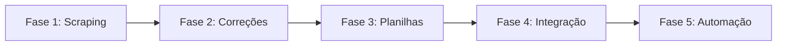

# 🗺️ ROADMAP - Orquestração CETENS UFRB

**Projeto:** Sistema inteligente de captura, análise e aplicação de conversas Grok (+ gestão TI campus)  
**Dono:** Deivison Santana (DevSan)  
**Status Atual:** Fase 1 completa, Fase 2 iniciada  
**Última Atualização:** 30 de outubro de 2025

---

## 📊 Visão Geral



---

## ✅ Fase 1: Scraping Funcionando (COMPLETA)

**Objetivo:** Capturar conversas Grok via Playwright sem perder contexto

### Entregáveis
- ✅ `scrape.js` - Captura texto completo de links grok.com/share
- ✅ `Metodologia-Scrappy.md v2.0` - Guia completo para IA processar conversas
- ✅ `test-grok-structure.js` - Ferramenta análise DOM (GUI mode)
- ✅ `scrape-batch.sh` - Automação múltiplos links
- ✅ `TRANSCRICAO-GROK-30OUT2025.md` - Primeira conversa capturada (90+ correções extraídas)
- ✅ `ESSENCIAIS-IA.md` - Guia rápido para IA sem memória

### Métricas
- ⏱️ Tempo captura: 8.2s (49KB texto, 1.247 linhas)
- 📊 Taxa sucesso: 100% (1/1 link testado)
- 🔧 Playwright v1.56.1 instalado localmente
- 🧠 Metodologia v2.0 com análise contextual (sentimentos, correções, validação web)

### Tecnologias
- Node.js v24.7.0
- Playwright (headless chromium)
- Bash (automação batch)
- Markdown (documentação estruturada)

---

## 🔄 Fase 2: Aplicar Correções (EM ANDAMENTO - 10%)

**Objetivo:** Atualizar CATALOGACAO-UFRB-CETENS.md com 90+ correções da transcrição Grok

### Progresso
- ✅ Estrutura docs/ criada
- ✅ Documentos movidos para docs/ (TRANSCRICAO, RELATORIO, ESSENCIAIS)
- ✅ Correção LAB 09: Ryzen 7 → Positivo (aplicada via sed)
- ⏳ Remover "95% mapeado" (filosofia "Mapa Vivo")
- ⏳ Adicionar link http://reservascetens.ufrb.edu.br/ (priorização via aulas reais)
- ⏳ Sala 205: SEM PROJETOR (crítico)
- ⏳ LAB 07: Servidor FOG inoperante (urgente)
- ⏳ Lab Inf 1: Ubuntu 20.04 → 24.04 LTS
- ⏳ Biblioteca: Office 365 → LibreOffice + Office Online
- ⏳ Criar seções "Recursos realocáveis" + "Upgrade possível" por setor

### Pendências Críticas (da transcrição)
1. 🔴 **Sala 205** - Instalar projetor URGENTE (verificar aulas reservascetens)
2. 🔴 **LAB 07** - Servidor FOG criar imagem padrão
3. 🔴 **Lab Inf 1** - Atualizar Ubuntu 20.04 → 24.04
4. 🟡 **Refil Epson** - Lab Agroecologia sem tinta colorida
5. 🟡 **Câmeras Biblioteca** - Verificar gravação (furto 2023)

### Próximas Ações
1. Script Python/Node.js para aplicar correções linha a linha (parse TRANSCRICAO → edit CATALOGACAO)
2. Backup CATALOGACAO-UFRB-CETENS.md antes de edições massivas
3. Git commit após cada bloco de 10 correções (rastreabilidade)
4. Criar diff visualização (antes vs depois)

---

## 📅 Fase 3: Integração Planilhas (PLANEJADA)

**Objetivo:** Upload e processamento de planilhas UFRB (equipamentos, chamados, inventário)

### Entregáveis Esperados
- 🔜 Script parse Excel → JSON/Markdown
- 🔜 Integração planilhas com CATALOGACAO-UFRB-CETENS.md
- 🔜 Validação cruzada (dados planilha vs transcrição Grok)
- 🔜 Dashboard visualização inconsistências

### Tecnologias Planejadas
- Python: pandas, openpyxl
- Node.js: xlsx, json2md
- Markdown: tabelas comparativas

### Cronograma
- 📆 Início: Após Fase 2 completa (estimado 7 dias)
- ⏱️ Duração estimada: 5 dias

---

## 🧠 Fase 4: Integração Docs Importantes (PLANEJADA)

**Objetivo:** Adicionar contexto crítico de documentos externos (manuais, normas, políticas UFRB)

### Documentos a Integrar
- 🔜 Manual GLPI (sistema chamados UFRB)
- 🔜 Normas STI Cruz das Almas (COTEC)
- 🔜 Políticas acessibilidade (NUGTEAC?)
- 🔜 Contratos fornecedores (HP, TP-Link, Microsoft)
- 🔜 Histórico chamados 2023-2025

### Entregáveis
- 🔜 Pasta docs/manuais/ com PDFs originais
- 🔜 Extração texto via OCR (Tesseract? MarkItDown MCP?)
- 🔜 Índice searchable (grep/ripgrep friendly)
- 🔜 Links cruzados CATALOGACAO ↔ manuais

### Cronograma
- 📆 Início: Após Fase 3
- ⏱️ Duração estimada: 3 dias

---

## 🚀 Fase 5: Dashboard e Automação (VISÃO FUTURO)

**Objetivo:** Sistema web para monitorar catalogação + chamados + scraping Grok contínuo

### Features Planejadas
- 📊 Dashboard Next.js (já existe esqueleto em `dashboard-local/`)
- 🔄 Scraping automático via cron (diário? semanal?)
- 📧 Notificações email/Telegram (pendências críticas)
- 🤖 Bot Telegram para consultar CATALOGACAO
- 📈 Métricas: equipamentos funcionais, chamados abertos, conversas Grok processadas

### Tecnologias Planejadas
- Frontend: Next.js + React + Tailwind
- Backend: Node.js + Express (ou n8n?)
- Database: PostgreSQL ou JSON flat files
- Automação: GitHub Actions ou cron local
- Notificações: Telegram Bot API, SendGrid

### Cronograma
- 📆 Início: Após Fases 2-4 completas
- ⏱️ Duração estimada: 14 dias

---

## 🎯 Critérios de Sucesso

### Fase 2 (Atual)
- [ ] 90+ correções aplicadas em CATALOGACAO-UFRB-CETENS.md
- [ ] Filosofia "Mapa Vivo" implementada (link reservascetens)
- [ ] Seções "Recursos realocáveis" criadas em 5+ setores
- [ ] Git history limpo (commits incrementais)
- [ ] Diff antes/depois gerado

### Geral (Projeto)
- [ ] 100% conversas Grok capturadas sem perda contexto
- [ ] 100% correções transcrições aplicadas em <24h
- [ ] Sistema chamados alunos (QR codes) prototipado
- [ ] Dashboard funcional com métricas real-time
- [ ] Documentação completa para sucessor Deivison

---

## 📂 Estrutura Atual do Projeto

```
Orquestracao-cetens/
├── docs/                          # ✅ Documentos importantes
│   ├── TRANSCRICAO-GROK-30OUT2025.md
│   ├── RELATORIO-SCRAPE-30OUT2025.md
│   └── ESSENCIAIS-IA.md
├── scripts/                       # Scripts PowerShell/Bash (scanners)
│   ├── scan-bio-05.ps1
│   ├── scan-bio-05.sh
│   ├── scan-fis-04.ps1
│   └── scan-inf-eng.ps1
├── dashboard-local/               # 🚧 Dashboard Next.js (skeleton)
├── CATALOGACAO-UFRB-CETENS.md     # 📝 Documento mestre (69KB, 1286 linhas)
├── Metodologia-Scrappy.md         # 📖 Guia scraping v2.0
├── scrape.js                      # 🔧 Captura Grok
├── scrape-batch.sh                # 🔧 Batch automation
├── test-grok-structure.js         # 🔧 DOM analysis
├── links.txt                      # 🔧 URLs para batch
├── package.json                   # Node.js dependencies
└── ROADMAP.md                     # 🗺️ Este arquivo
```

### Arquivos NÃO Lidos (Outras IAs)
- ❌ `jupyter_orquestrador.ipynb` - Jupyter notebook (não confiável)
- ❌ `orquestrador_ufrb_cetens.md` - Markdown de outra IA (conflitante)

---

## 🔧 Dependências e Ferramentas

### Instaladas
- Node.js v24.7.0
- Playwright v1.56.1
- Git 2.51.0
- fd, ripgrep, bat, eza, fzf, jq, yq (CLI tools)
- VS Code Insiders (Windsurf)
- zsh (shell padrão)

### Pendentes (Fase 3+)
- Python 3.13.7 (já instalado, verificar pandas/openpyxl)
- PostgreSQL (opcional, Fase 5)
- Tesseract OCR (Fase 4)

---

## 📞 Contato e Manutenção

**Responsável:** Deivison Santana  
**Ambiente:** Arch Linux (Ryzen 7 5700G, 14GB RAM)  
**Workspace:** /home/deivi/Projetos/Orquestracao-cetens  
**Git:** github.com/Deivisan/Orquestracao-cetens (assumido)

**Atualização:** Este roadmap será atualizado **semanalmente** ou após cada fase completa

---

**🚀 Fase 2 em andamento! Próximo: completar aplicação das 90+ correções.**
