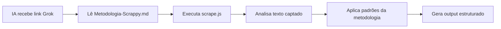

# ✅ Arquivos Essenciais para IA Sem Memória

## 🎯 Para IA processar conversas Grok, só precisa de:

### 1️⃣ scrape.js (Captador)
**Função:** Abre o link Grok e extrai todo o texto da conversa

**Uso:**
```bash
node scrape.js "https://grok.com/share/c2hhcmQtMg%3D%3D_..."
```

**Localização:** `/home/deivi/Projetos/Orquestracao-cetens/scrape.js`

---

### 2️⃣ Metodologia-Scrappy.md (Contexto)
**Função:** Instruções completas de como processar o texto captado

**Contém:**
- Como detectar sentimentos/correções/validações
- Como validar atualidade via web
- Estrutura JSON esperada
- Checklist de análise contextual
- Padrões conversacionais ("entendeu?", "repete")

**Localização:** `/home/deivi/Projetos/Orquestracao-cetens/Metodologia-Scrappy.md`

---

## 🚀 Workflow para IA Sem Memória:



**1.** IA lê `Metodologia-Scrappy.md` (ganha contexto total)
**2.** IA executa `node scrape.js "link"` (captura texto)
**3.** IA aplica análise contextual descrita na metodologia
**4.** IA gera JSON + Markdown com tudo processado

---

## 📦 Arquivos Auxiliares (Opcionais):

Estes **não são necessários** para IA processar, mas facilitam uso humano:

- `scrape-batch.sh` - Automação para múltiplos links
- `test-grok-structure.js` - Debug estrutura DOM
- `links.txt` - Lista de URLs para batch
- `TRANSCRICAO-*.md` - Outputs já gerados (exemplos)

---

## ✅ Checklist IA Sem Memória:

Quando receber tarefa "processar conversa Grok":

- [ ] Ler `Metodologia-Scrappy.md` completo (contexto)
- [ ] Executar `scrape.js` com link fornecido (captação)
- [ ] Detectar padrões conversacionais (metodologia seção 2)
- [ ] Validar atualidade via web (metodologia seção 4)
- [ ] Extrair pendências/correções (metodologia seção 5)
- [ ] Gerar JSON estruturado (metodologia template linha 81)
- [ ] Criar Markdown consolidado (metodologia linha 103)

---

**Resumo:** IA só precisa de **`scrape.js`** + **`Metodologia-Scrappy.md`** para funcionar 100% automaticamente! 🚀
